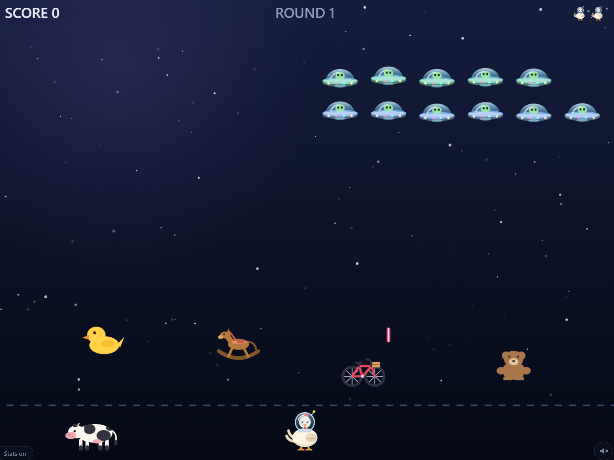

# Farm Invaders



## Tl;DR
Space Invaders, except the invaders are flying saucers with enormous windscreens
and the defender is a chicken in a space helmet, armed with eggs.

[Play here](https://zerogvt.github.io/farm-invaders/) 

## Longer Explanation [AI recap]

A run opens with the saucers demanding **"give us the cow now!"**, the hen
answering **"never!"**, and the shooting starting. The cow stands on the ground
behind her the whole time. If she runs out of lives, a mothership comes down,
puts a tractor beam on the cow and takes it, and the cow has just enough time to
say **"Moooooooooo"** on the way up. It is happier the rest of the time: every
round the hen clears gets a **"Moo"**.

An egg does not shoot a saucer down. One that connects bursts across the canopy
and blinds the pilot: the saucer drops out of the formation, hangs there reeling
for a moment, then banks over and limps off whichever side of the screen is
nearer. It scores when it is gone. Toys scattered across the floor absorb
anything that hits them — the hen's eggs and the saucers' lasers alike — and no
amount of fire wears them down, or leaves a mark on them.

**Eggs shoot lasers down.** An egg that meets a laser in mid-air takes it out
and is spent doing it, so a well-aimed egg is a shield as well as a shot.

**The toys are not nailed down.** An egg comes from below, so it punts the toy it
hits up into the fleet, and anything a loose toy ploughs into goes up. Every
wreck costs the toy a hit point, so a punted teddy bear is worth three or four
saucers and no more. Lasers are simply absorbed; they never move a toy, because
a toy pushed downwards is cover turning into a hazard the hen cannot dodge.

**Every second round is a mothership** rather than a fleet. It takes one egg per
round number to see off, and the banner says so before the round starts. It
answers with a volley of two directions fewer than the round number and then
halved, fired at a third of the rate it started at — it is also the only thing
out there that shoots at an angle, since rank-and-file saucers only ever fire
straight down. Every five to ten seconds it runs a **windscreen wiper** across
its canopy, clearing about a fifth of the egg on it — picked at random — and
every egg it clears is a hit point back. It needs three eggs up there before a
fifth comes to one, so a barely touched mothership never bothers.

**Watch out for radioactive foxes.** Every eight to sixteen seconds on a fleet
round, a saucer in the front rank drops a glowing green fox instead of firing.
Eggs go straight through it, toys do not stop it and the black hole does not
take it: it falls to the ground, lands on its feet and runs off the nearer side.
If it touches the hen on the way she loses a life. The shield is the one thing
that keeps it off her.

**When the hen loses a life** she lets out a **"buk-buk-BAWK!"** and a handful
of feathers come off her and drift down.

**A tenth of every fleet deserts.** Somewhere in each round, one saucer in ten
decides it has had enough, says **make ❤️ not war** and flies home. They leave
unscored: talking somebody out of a fight is not the same as winning it.

**Every 2000 points is another hen**, awarded for each threshold crossed rather
than one per payout, so a single screen-clearing upgrade can hand back two.

**On about one round in three, Einstein turns up**, says **time freeze mate**,
and stops the board. The hen and everything she has already thrown carry on;
saucers, the mothership, lasers, loose toys and the clock on a Rambo egg all
stop where they are for five seconds. An egg that lands while time is stopped
does not start a retreat — there is nothing to retreat — so whatever it hits
simply goes up and scores on the spot.

**Watch the corners for a Rambo egg.** On roughly two rounds in five one turns up
in a top corner, sits there for ten seconds, and upgrades the hen's eggs if she
can hit it before it leaves. Which upgrade is not up to her:

| Upgrade | What it does |
| --- | --- |
| Multishot | Every shot becomes a fan of 5–20 eggs, for six seconds. |
| Super egg | One shot. It bursts at mid-screen and clears the sky outright. |
| Beam | A continuous beam for six seconds. It burns whatever it touches, and needs one second on the mothership per egg the mothership would have cost. |
| Shield | Ten seconds during which lasers simply do not land. |
| Exploding heart | One shot. The whole fleet deserts. The mothership declines — *"no xmas truce. This aint 1914. I'm da central command!"* — and the hen gets a super egg for her trouble. |
| Gravity waves | Five seconds of expanding rings. Anything a ring washes over loses attitude control, tumbles off at random, and detonates against whatever it blunders into, itself included. |
| Black hole | One shot. It opens at a random spot in the sky, and every saucer on the board — the mothership too — spirals into it and is swallowed, the nearer ones first. |
| Gramophone | One shot. It drifts up playing, and three seconds later the entire fleet goes up with it. |
| Cow burp | One shot. The cow lets go a cloud of bubbles that fans out across the whole screen; every saucer a bubble touches pops, and the mothership loses a hit point per bubble. |
| Wingman | Ten seconds of a second, brown hen who walks the ground by herself and throws eggs non-stop. Lasers that reach her are absorbed — she cannot be hurt until the upgrade runs out. |

Every upgrade announces itself over the playfield, because which one you have is
not something you chose — and every one of them carries a clock, shown in the
HUD as a name, the seconds left and a bar that drains, turning red over the last
three seconds. The single-shot upgrades are spent by firing them; their clock is
how long they can be carried unfired.

## Running it

```bash
npm install
npm run dev      # http://localhost:5173/farm-invaders/
npm test         # headless simulation checks
npm run build    # typecheck + production build into dist/
```

Controls: `←` `→` or `A`/`D` to move, `Space` to throw an egg, `M` to switch
the sound off and on. The speaker button in the bottom right corner does the
same, and the choice is remembered in the browser.

## Sound

Everything you hear is synthesised in the browser with the Web Audio API — there
are no audio files. The theme, *Hoedown in Orbit*, is an eight-bar chiptune loop
written for this game, so it carries no licence or royalty of any kind. Eggs pip
as they leave, splat on windscreens, and splat enormously as a super egg; saucers
and toys go up with a bang; lasers buzz; the cow moos at every cleared round,
burps when told to, and moos at length on its way into the mothership. The hen
clucks when she loses a life, a fox arrives with a crackle of Geiger clicks and a
yip, the black hole opens with a long swirling fall, and the mothership's wiper
squeaks. Browsers
keep audio off until the page has been clicked or typed at, so the sound starts
with the Start button.

## Telemetry

The game can report to Dynatrace Real User Monitoring: page loads, JavaScript
errors, and three game events — `game_started`, `power_gained` (which upgrade)
and `game_over` (score, round, whether sound was muted, and length in seconds).
All of it lives in `src/telemetry.ts`.

**It is off unless two things are true**:

1. `TELEMETRY_ENABLED` at the top of `src/telemetry.ts` is `true`. This is
   the kill switch. Set it to `false` and push, and the next deploy neither
   loads the Dynatrace agent nor sends anything. The build then drops the
   telemetry code entirely.
2. The repository variable `DT_RUM_SRC` (**Settings → Secrets and variables →
   Actions → Variables**) holds the agent's script URL from the Dynatrace web
   application's setup page. The deploy workflow passes it to the build as
   `VITE_DT_RUM_SRC`. Unset, the build reports nothing, which is also how local
   builds, tests and forks behave. Deleting the variable and re-running the
   deploy is a second way to turn telemetry off, without a commit.

The URL is not a secret. Anyone can read it from the page, and all it lets
anyone do is send data *into* this one application. Restrict the application's
beacon origins to `https://zerogvt.github.io` and cap its sessions in Dynatrace.
Never put a Dynatrace API token in this code.

**The player has to agree first.** The Dynatrace application runs in
**opt-in mode** ("Data-collection and opt-in mode" under the frontend's
**Settings → Data privacy**). In that mode the agent sets no cookies and captures
nothing until the page calls `dtrum.enable()`. When telemetry is live, a small card
in the bottom left corner asks the player. **Allow** calls `dtrum.enable()`,
and **No thanks** sends nothing. The answer is remembered in the browser, and the
card then shrinks to a **Stats on / Stats off** switch in the same corner, so
changing your mind is one click (`dtrum.disable()` to stop). A player who never
answers sends nothing. Keep opt-in mode on: without it the agent would start
monitoring before anyone was asked.

**What the Dynatrace frontend needs.** It must be on the new RUM experience,
since `sendEvent` doesn't exist on RUM Classic. Everything below is under
**Experience Vitals → Overview → Web →** the frontend **→ Settings**:

- **Data privacy:** "Data-collection and opt-in mode" on. Leave IP masking and
  "Do Not Track" compliance on, as they are by default.
- **Capture properties → Allowed API-reported properties:** add `game_event`,
  `score`, `round`, `power`, `seconds` and `muted`. Enter the keys without the
  `event_properties.` prefix. **Any property not on this list is dropped at
  ingest.** The event still arrives, but with those fields empty, so every
  query filtering on them returns nothing. Adding a key only affects events
  sent afterwards. Add a key here whenever `telemetry.ts` starts sending a new
  field.
- **Beacon origins:** accept beacons only from `https://zerogvt.github.io`.
- **Cost control:** cap or sample sessions.

**Checking it works.** Open the live game with DevTools on the Network tab. The
`…_complete.js` agent script should load from `js-cdn.dynatrace.com` with status
200. After **Allow** and one game, requests to a path starting with `rb_` should
go to the tenant. Those are the beacons. If the script shows
`ERR_BLOCKED_BY_CLIENT`, the browser refused to fetch it, and Dynatrace never
saw the request. The usual causes are an ad blocker, the browser's tracking
protection, a DevTools request-blocking rule, or an extension or security tool
installed by your organisation. A phone on mobile data is a quick way to rule
your own machine out.

The game events land in `user.events` within a minute or two. RUM events keep
their time in `start_time`, not `timestamp`:

```dql
fetch user.events, from: now() - 24h
| filter isNotNull(event_properties.game_event)
| fields start_time, dt.rum.session.id, event_properties.game_event,
         event_properties.score, event_properties.round, event_properties.power,
         event_properties.seconds, event_properties.muted
| sort start_time desc
```

How far players get:

```dql
fetch user.events, from: now() - 7d
| filter event_properties.game_event == "game_over"
| summarize games = count(), avg_score = avg(event_properties.score),
            avg_seconds = avg(event_properties.seconds),
            by: {round = event_properties.round}
| sort round asc
```

If the first query is empty, check whether the events are arriving at all.
`characteristics.is_api_reported` marks the `sendEvent` calls:

```dql
fetch user.events, from: now() - 24h
| summarize events = count(), by: {characteristics.is_api_reported}
```

Rows with `true` mean the events arrive, so it's the property allow-list. No
rows at all means the frontend is not writing to `user.events`. Sessions in
`user.sessions` are only written after about 30 minutes of inactivity, so they
lag behind the events.

**To remove telemetry completely:**

1. Delete `src/telemetry.ts`.
2. Delete every line in `src/main.ts` that mentions `telemetry` (one import,
   five calls).
3. Delete the telemetry block in `tests/simulation.test.ts` (its import, and
   the block that starts `// Telemetry.`).
4. Delete the `env:` block under `npm run build` in
   `.github/workflows/deploy.yml`, and the `DT_RUM_SRC` variable.
5. Delete this section.

`npm run build` and `npm test` will then report anything left over.

## How it is put together

No game engine and no image files. Plain TypeScript, Canvas 2D, and Vite.

| File | What lives there |
| --- | --- |
| `src/config.ts` | Every tunable number. Balancing happens here and nowhere else. |
| `src/game.ts` | The whole simulation: marching, splattering, retreats, the mothership, upgrades, collisions, rounds. Touches no DOM, which is why it can be tested headlessly. |
| `src/sprites.ts` | Every sprite, drawn with canvas paths at startup. The only file that knows what anything looks like. |
| `src/render.ts` | Draws a frame from game state. Never mutates it. |
| `src/ui.ts` | Title card, round banner and game-over panel, as real DOM so buttons and the initials field are keyboard-operable. |
| `src/scores.ts` | High scores in `localStorage`. |
| `src/input.ts` | Keyboard state. |
| `src/audio.ts` | Every sound effect and the theme, synthesised with Web Audio. The only file that knows what anything sounds like. |
| `src/soundToggle.ts` | The speaker button and the `M` key, and remembering the choice. |
| `src/main.ts` | Canvas setup, the frame loop, and which event makes which sound. |

### Design decisions worth knowing

**A splattered saucer leaves the formation outright.** It stops taking march
steps, steers itself, and is skipped by the wall-bounce bounds, the front-line
firing check and the invasion check. That last part matters more than it looks:
a retreating saucer crossing the side wall would otherwise bounce and drop the
entire formation on the hen's head, and one sinking past the line on its way out
would end the run. There is a test for each.

**It scores when it leaves, not when it is hit.** The retreat is the reward
animation, and paying out at impact would make the last second of it dead time.
The cost is that a round is not cleared until the final saucer is fully out of
the view, which is about a second of watching it go.

**A second egg into a splattered saucer is wasted.** It bursts on a windscreen
that is already covered and the saucer is unaffected. With only three eggs
allowed in flight, that is the entire cost the retreat delay imposes, and
removing it would make the delay purely cosmetic.

**The mothership is its own field, not a saucer with a flag.** `state.boss` sits
beside `state.ufos` rather than inside it, because almost nothing a saucer does
applies to it: it does not march, does not hold a column, does not die to one
egg, and steers itself. Threading a `boss: true` through the formation code
would have meant a special case in every function that walks `ufos`. What it
does share is the retreat, so it reuses `UfoState` for that and nothing else.

**One second of beam equals one egg.** The beam takes the mothership down at one
hit point per second, so the rule "as many seconds as it would have taken eggs"
is arithmetic rather than a second mechanic to keep in step with the first. The
beam passes straight through the toys: they are the player's cover, and watching
it evaporate under their own upgrade reads as a bug however it is explained.

**The super egg spares the toys and the mothership's hit points alike.** It
clears every saucer and whatever the mothership has left, which makes it wildly
strong on a boss round — that is the point of a one-in-sixteen pickup. It leaves
the obstacles standing, because the best thing in the game should not also be the
thing that strips your cover.

**An upgrade survives the round it was won in.** Timers keep running across the
round break rather than being reset by `startRound`, so a shield picked up in the
last second of a round is not confiscated for clearing it.

**The freeze exempts the hen, not the player.** `update` runs the hen, her
shots, her waves and her beam every frame and skips the rest of the board's
ticks while `state.freeze` is set. Advancing lasers had to be split out of
advancing her shots for that, which is the only structural cost of the whole
feature.

**A stopped laser cannot hurt anybody.** Collisions between lasers and the hen
are skipped for the duration. A frozen laser is a stationary object, and walking
into one costing a life would make a gift into a hazard — including the case
where time stops with one already sitting on her.

**Stopped time is not a free mothership.** Eggs still take it one hit point at a
time. It cannot shoot back for five seconds, which is reward enough.

**Every upgrade has a clock, including the ones that are a single shot.** A
countdown the player can read is worth more than the words "one shot", which say
nothing about how long there is to line the shot up. The hold on a single-shot
upgrade is deliberately generous: it exists so the HUD has something to show and
so nothing can be carried indefinitely, not to punish anyone for taking aim.

**The black hole is a single shot that the hen does not aim.** It used to be six
seconds of small holes climbing the screen. It is now one hole that opens at a
random spot in the sky and takes everything at once, so it is one of the
screen-clearers alongside the super egg and the gramophone. What it looks like
is the point: every hull caught spirals in, spinning faster and shrinking as it
nears the middle, rather than simply vanishing. It keeps pulling while time is
stopped, because it is the hen's, and it spares deserters, which are out of the
war already, and foxes, which nothing kills.

**The cow is scenery, and that is the point.** It has no state, no collision box
and no hit points — it is drawn at a fixed spot and nothing it says is
simulated. All it has to do is be there, so that the opening demand has
something to refer to and the closing scene has something to take. Its burp is
the one exception, and even that is the hen's upgrade: the simulation only needs
to know where its mouth is.

**The wingman lives inside the upgrade.** Her position and firing clock are
fields of the `wingman` power rather than a second `Hen`, so she arrives and
leaves with it and nothing else has to know about her. Her eggs are flagged, so
they do not count against the hen's cap and cannot collect a Rambo egg — which
would replace the very upgrade she is part of.

**The run is not over when the last hen falls.** `endGame` moves the game into
an `abduction` phase and `onGameOver` fires when that phase ends, which is what
keeps the game-over panel from covering the scene. The board is left exactly as
it stopped and dimmed behind it; the whole thing is driven off one age counter,
so the simulation counts and the renderer decides what that looks like.

**One state for every way off the board.** `UfoState` has a single `leaving`
variant with a `reason`, rather than separate `splattered` and `deserting`
kinds. The two share every movement rule — hang in place, turn for the nearer
wall, accelerate — and differ only in the sprite, the speech bubble, whether
they sink, and whether they score. Two variants would have meant two copies of
the exit code drifting apart.

**Only the mothership shoots at an angle.** Rank-and-file lasers all travel
straight down. Lasers still carry a velocity rather than a fixed fall, because
the mothership's fanned volleys need it, but nothing else uses it.

**Deserters and hearts pay nothing.** Score is for saucers the player actually
drove off. Everything that leaves of its own accord — a scheduled desertion, or
a whole fleet talked out of it by a heart — leaves unscored, which is the price
of the heart being the most spectacular thing in the game.

**Three upgrades take the mothership outright** (super egg, black hole,
gramophone), three grind it down (the beam at one hit point per second, gravity
waves at one per wave, the burp at one per bubble that lands), the heart is
refused, and multishot, the shield and the wingman do what they always do. That
spread is deliberate: a boss round should sometimes be stolen by a lucky pickup,
but three of the ten have to be earned and three are no help beyond the usual.

**Lasers travel at half the speed they once did.** That has a second effect
worth knowing about: a slower shot is on screen for longer, so the cap on lasers
in flight bites more often. In round 1, where the cap is two, the fleet gets off
about a quarter fewer shots as a result; by round 3 the cap has grown and the
interval has shortened enough that it makes no difference.

**Difficulty scales on four axes, not one.** Each round adds rows (to five),
fires lasers more often and faster, allows more of them on screen at once, and
starts the formation lower. On top of that the formation accelerates as its
ranks thin within a round, so the last saucer is the frightening one. The fleet
is six columns by two ranks in round 1, narrower and shallower than it once was,
which is the single biggest lever on how hard the early rounds feel.

**Cover is spent, not eroded.** Nothing that is shot at a toy damages it: eggs,
lasers and everything the upgrades fire are all simply absorbed. What stops the
player parking behind one for ever is that a toy blocks her own eggs as
readily as it blocks the fleet's lasers, so a toy overhead is a wall in both
directions. The only way to clear it is to punt it up into the fleet with those
same eggs — which costs shots and gives up the cover. That is a decision rather
than an erosion, and it replaces the original's crumbling bunkers with a trade.

**A wrecked saucer costs the loose toy a hit point, and nothing else does.**
Those four hit points are no longer a health bar — they are how many saucers a
launched toy is worth before it breaks up. Without the cost one egg into a toy
would sweep a column clean and the toy would still be climbing.

**Toy placement is constrained, not freely random.** The usable width is divided
into one lane per toy and each toy is jittered inside its own lane. They can
therefore never overlap at the start of a round, never touch the walls, and
never line up into a barrier that seals off a column. Once they are loose they
are free to go anywhere, including through each other — four toys are too few
for toy-on-toy collisions to be worth the frame time.

**Sprites are drawn in code rather than loaded.** Cruder than hand-drawn art, but
identical on every platform, nothing to license, and clean and egg-covered
canopies can share one hull. Swapping to emoji or PNGs means rewriting
`src/sprites.ts` and nothing else.

### Known limits

- **Desktop keyboard only.** There are no touch controls, so the game is not
  playable on a phone. Adding them means a second input source writing the same
  three fields in `src/input.ts`.
- **Sound is synthesised, not recorded.** It is chiptune by construction — a
  splat is filtered noise, a moo is a sawtooth through a vowel filter. Swapping
  in recorded samples means changing the effect table in `src/audio.ts` and
  nothing else.
- **High scores are per-browser.** They live in `localStorage`, are not shared
  between players or devices, and vanish when site data is cleared.
- **Einstein cannot be missed, or sought.** The visit is on a timer, not a
  pickup: there is nothing to shoot and nothing to steer towards, so a round
  either gets one or does not.
- **Upgrades are not chosen.** Which of the ten a Rambo egg grants is random and
  cannot be influenced. That is deliberate — being able to plan around it would
  spoil the joke — but it does mean a run can be decided by a coin flip.
- **The obstacles are mostly nursery toys.** They are carried over from the
  previous theme, so a rocking horse and a teddy bear are what shields the hen
  from orbital laser fire — and, now, what she fires back. A bicycle and a
  tractor have joined them, and an alien doll; each round draws four of the
  seven. Replacing them is
  confined to the toy painters in `src/sprites.ts` and the `ToyKind` union.

## Deploying to GitHub Pages

`.github/workflows/deploy.yml` builds and publishes `dist/` on every push to
`main`. It assumes **this directory is the repository root**. Two things must be
true before it works:

1. The repository is named `farm-invaders`, so that `base` in `vite.config.ts`
   matches the URL GitHub Pages serves from (`/farm-invaders/`). If the
   repository has a different name, change `base` to match it.
2. Pages is enabled with **Settings → Pages → Source → GitHub Actions**.
